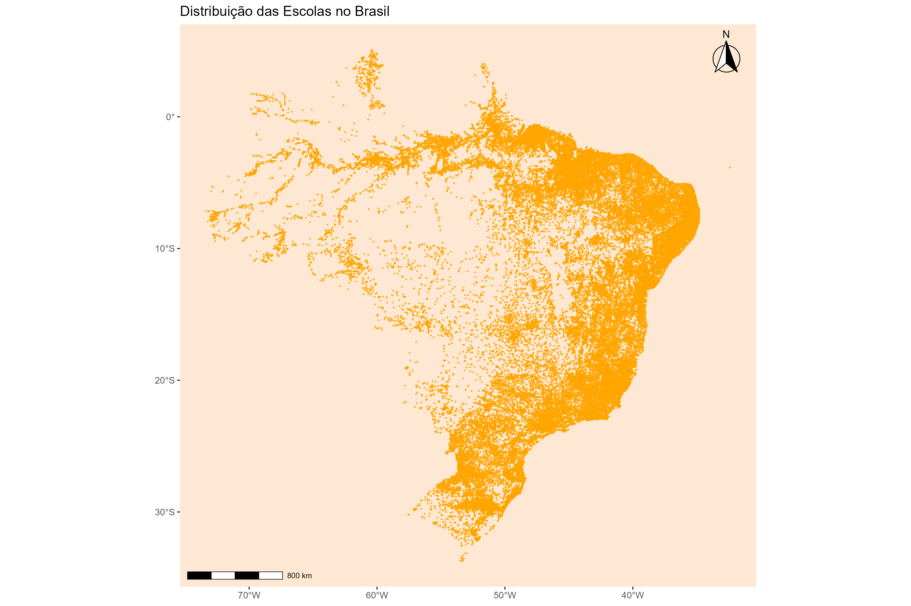
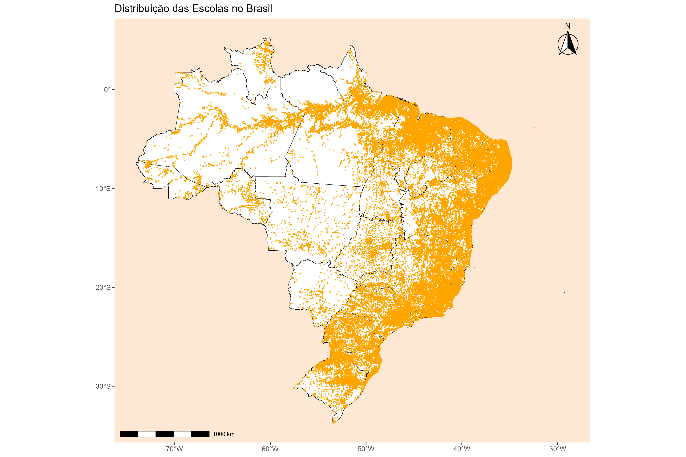
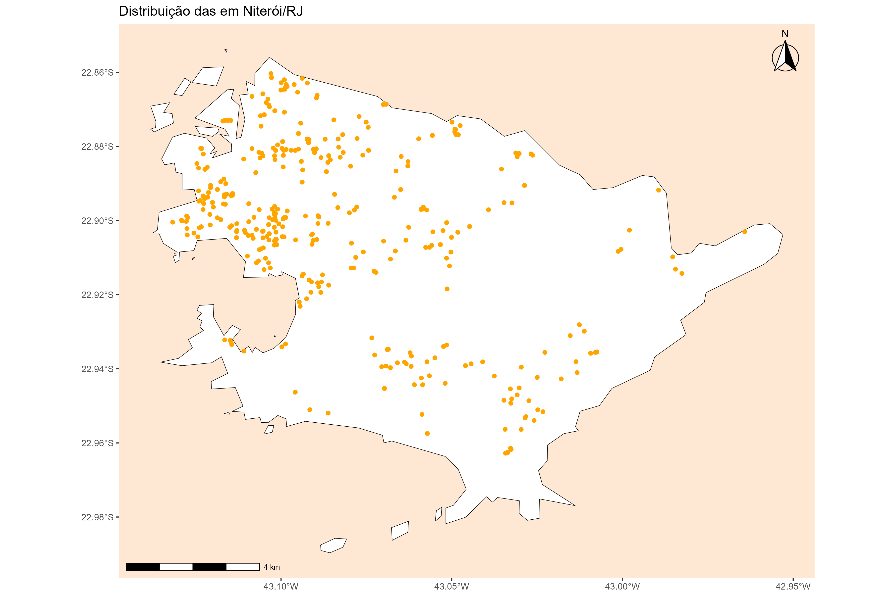

```{r,include=F}

# bibliotecas ####

require(dplyr) # Manipulação de bases de dados
require(geobr) # Shapefiles do Brasil
require(ggiraph) # Mapas interativos
require(ggplot2) # Gráficos
require(ggsflabel) # Criação de Labels que se repelem
require(ggspatial) # Rosa dos ventos e escala
require(readxl) # Leitura de arquivos excel
require(sf) # Leitura de shapefiles fora do geobr
require(gtsummary)
require(openxlsx)
remotes::install_github("ipeaGIT/geobr", subdir = "r-package")
devtools::install_github("yutannihilation/ggsflabel")

# Dados ####

Indicadores = read_excel("Indicadores_Municipais.xlsx")

args(read_schools)
Dados_escola = read_schools(year = 2025,
                            showProgress = F)

no_esc = read_schools(year = 2025,
                      showProgress = F) %>% 
  filter(!st_is_empty(geometry)) %>%
  nrow()
no_esc

args(read_semiarid)
Dados_semi = read_semiarid(year = 2022,
                           simplified = T,
                           showProgress = T)

no_semi = read_semiarid(year = 2022,
                       simplified = T,
                      showProgress = F) %>% 
  filter(!st_is_empty(geometry)) %>%
  nrow()
no_semi

map_brasil2 = read_country(year=2022,
                     simplified = T,
                     showProgress = F)
  
regioes_br = read_region(year = 2022,
                         simplified = T,
                         showProgress = F)

estados_br = read_state(code_state = "all",
                        year = 2022, simplified = T,
                        showProgress = F)

map_regioes = estados_br %>% 
  filter(code_region %in% c(2, 3))

schools <- read_schools(year=2025)

states <- read_state(year=2025)

schools_muni <- schools %>% 
  filter(code_muni == 3303302)

muni <- read_municipality(year = 2025, code_muni=	
3303302)

#brasil schools ####

ggplot() +
  geom_sf(data = schools,
          color = "orange",
          size = 0.1) +
  theme(
    panel.grid       = element_blank(),
 
    panel.background = element_rect(fill = "#ffe8d3"),
 
  )+

  annotation_scale(
    location   = "bl",
    width_hint = 0.2,
    text_cex   = 0.6,
    line_width = 0.7,
  ) +

  annotation_north_arrow(location = "tr",
                         style = north_arrow_fancy_orienteering)+

  labs(
    title = "Distribuição das Escolas no Brasil"
  )

#muni schools ####

ggplot() +
  geom_sf(data = muni,
          fill = "white",
          color = "black") +
  geom_sf(data = schools_muni,
          color = "orange",
          size = 1.5) +
  theme(
    panel.grid = element_blank(),
 
    panel.background = element_rect(fill = "#ffe8d3"),
 
  )+

  annotation_scale(
    location   = "bl",
    width_hint = 0.2,
    text_cex   = 0.6,
    line_width = 0.7,
  ) +

  annotation_north_arrow(location = "tr",
                         style = north_arrow_fancy_orienteering)+

  labs(
    title = "Distribuição das em Niterói/RJ"
  )

# states schools ####

ggplot() +
  geom_sf(data = states,
          fill = "white",
          color = "black") +
  geom_sf(data = schools,
          color = "orange",
          size = 0.1) +
  theme(
    panel.grid       = element_blank(),
 
    panel.background = element_rect(fill = "#ffe8d3"),
 
  )+

  annotation_scale(
    location   = "bl",
    width_hint = 0.2,
    text_cex   = 0.6,
    line_width = 0.7,
  ) +

  annotation_north_arrow(location = "tr",
                         style = north_arrow_fancy_orienteering)+

  labs(
    title = "Distribuição das Escolas no Brasil"
  )

# brasil ####

brasil_semi = ggplot() +
  geom_sf(data = map_brasil2,
          fill = "white", color = "black", linewidth = 0.2) +
  geom_sf(data = Dados_semi,
          fill = "#C86734", color = "white", linewidth = 0.03) +

  annotation_scale(
    location   = "bl",
    width_hint = 0.2,
    text_cex   = 0.6,
    line_width = 0.7,
  ) +

  annotation_north_arrow(location = "tr",
                         style = north_arrow_fancy_orienteering)+
  labs(title = "Brasil") +
  theme_minimal() +
  theme(
    plot.title = element_text(
      face = "bold",
      size = 20,
      color = "black",
      hjust = 0.5),
    
    panel.grid       = element_blank(),
    axis.text        = element_blank(),

    panel.background = element_rect(fill = "#ffe8d3"),
    
    panel.border = element_rect(
      color     = "#C86734",
      fill      = NA,
      linewidth = 0.5
    )
  )
brasil_semi

# nordeste / sudeste ####

map_semi_reg = ggplot() +
  geom_sf(data = map_regioes,
          fill = "white", color = "black", linewidth = 0.2) +
  geom_sf(data = Dados_semi,
          fill = "#C86734", color = "white", linewidth = 0.03) +

    annotation_scale(
    location   = "bl",
    width_hint = 0.2,
    text_cex   = 0.6,
    line_width = 0.7
  ) +
  
  annotation_north_arrow(location = "tr",
                         style = north_arrow_fancy_orienteering)+
  
  labs(title = "Semiárido: Nordeste / Sudeste") +
  
  theme_minimal() +
  
  theme(
    plot.title = element_text(
      face = "bold",
      size = 20,
      color = "black",
      hjust = 0.5
    ),
    
    panel.grid       = element_blank(),
    axis.text        = element_blank(),
    
    panel.background = element_rect(fill = "#ffe8d3"),
    
    panel.border = element_rect(
      color     = "#C86734",
      fill      = NA,
      linewidth = 0.5
    )
  )
map_semi_reg

```


# **Função read_schools**{data-background-image="Capa.png" style="text-align:center"}

## **O que a base representa?**


A função **read_schools()** disponibiliza a localização geográfica das escolas brasileiras a partir dos dados do Censo Escolar.

:::: columns

::: {.column width="50%"}
::: box-gray
**Características principais:**

* Dados oficiais do INEP;
* Cada registro representa uma escola;
* Geometria do tipo POINT;
* Sistema de referência: SIRGAS 2000 (CRS 4674).
* Nível territorial: Estabelecimento de ensino (escola).
:::
:::

::: {.column width="45%"}
::: box-gray
**Aplicações:**

* Planejamento educacional;
* Estudos de acessibilidade;
* Distribuição espacial das escolas;
* Análises territoriais.
:::
:::

::::

## **Explorando a função**

**Sintaxe**

:::: columns

::: {.column width="35%"}
library(geobr)

schools <- read_schools( <br>
  year,<br>
  code_muni = "all",<br>
  output = "sf",<br>
  showProgress = TRUE,<br>
  cache = TRUE,<br>
  verbose = TRUE    )
:::

::: {.column width="60%"}
| Argumento    | Função                               |
| ------------ | -------------------------------------|
| year         | ano da base                          |
| code_muni    | código do município                  |
| output       | tipo de objeto retornado pela função |
| showProgress | exibe progresso                      |
| cache        | salva localmente                     |
| verbose      | apresenta mensagens informativas     |

:::
::::

<br>

::: box-gray
**Retorno**
 Classe: > [1] "sf" "data.frame"
:::


## **Estrutura dos dados**

::: {.panel-tabset}

### Informações disponíveis

* Código da escola;
* Nome da escola;
* Município;
* UF;
* Coordenadas geográficas;
* Data de atualização;
* Geometria espacial.
* Novidades da atualização

### A nova versão do geobr

1. melhor organização das bases;
2. armazenamento mais eficiente;
3. integração com formatos modernos;
4. melhoria na qualidade das coordenadas espaciais.

**Objetivo principal:** aumentar velocidade e confiabilidade das análises.

:::

## **Mapa: Escolas do Brasil (2025)**

{fig-align="center" width=70%}

## **Sobreposição com read_states**

{fig-align="center" width=70%}

## Sobreposição com read_municipality

{fig-align="center" width=70%}


## 
**Interpretação**

<br>

* Cada ponto representa uma escola;
* Maior concentração nas áreas urbanizadas;
* Permite visualizar a distribuição espacial tanto nacional, quanto municipal.


# **Função read_semiarid**{data-background-image="Capa.png" style="text-align:center"}

## Semiárido

<br>

:::: columns

::: {.column width="50%"}
::: box-orange
**Características principais:**

* Dados oficiais do IBGE / SUDENE (Superintendência do Desenvolvimento do Nordeste);
* Delimitação geográfica oficial;
* Geometria do tipo MULTIPOLYGON;
* Sistema de referência: SIRGAS 2000 (CRS 4674).
* Nível territorial: Região geoecológica (recorte por municípios).

:::
:::

::: {.column width="45%"}
::: box-orange
**Aplicações:**

* Formulação de políticas públicas regionais;
* Estudos sobre vulnerabilidade climática e seca;
* Planejamento econômico da área de atuação da SUDENE;
* Análises de governança e fundos constitucionais.

:::
:::

::::


## **Explorando a função**

**Sintaxe**

:::: columns

::: {.column width="35%"}
library(geobr)

read_semiarid(<br>
  year,<br>
  simplified = TRUE,<br>
  output = "sf",<br>
  showProgress = TRUE,<br>
  cache = TRUE,<br>
  verbose = TRUE)
:::

::: {.column width="60%"}
| Argumento    | Função                               |
| ------------ | -------------------------------------|
| year         | ano da base                          |
| simplified    | simplifica as linhas para carregar mais rápido        |
| output       | tipo de objeto retornado pela função |
| showProgress | exibe progresso                      |
| cache        | salva localmente                     |
| verbose      | apresenta mensagens informativas     |

:::
::::

<br>

::: box-orange
**Retorno**
 Classe: > [1] "sf" "data.frame"
:::

## **Mapa Semiárido (2022)**

{fig-align="center" width=70%}

##

{fig-align="center" width=70%}

## **Conclusão**

<br>


:::: columns

::: {.column width="50%"}
::: box-gray
✓ read_schools() acessa dados georreferenciados do Censo Escolar.

✓ Retorna objetos espaciais do tipo sf.

✓ Trabalha com geometrias do tipo ponto.

✓ Permite visualização espacial simples e sobreposição com outras camadas do geobr.

✓ É útil para planejamento educacional, pesquisa e análise territorial.


:::
:::

::: {.column width="45%"}
::: box-orange
✓ read_semiarid() acessa dados da delimitação legal do Semiárido brasileiro.

✓ Trabalha com geometrias do tipo multipolígono.

✓ Permite analisar as atualizações históricas.

✓ Estudos de vulnerabilidade climática e planejamento socioeconômico regional.

:::
:::

::::
