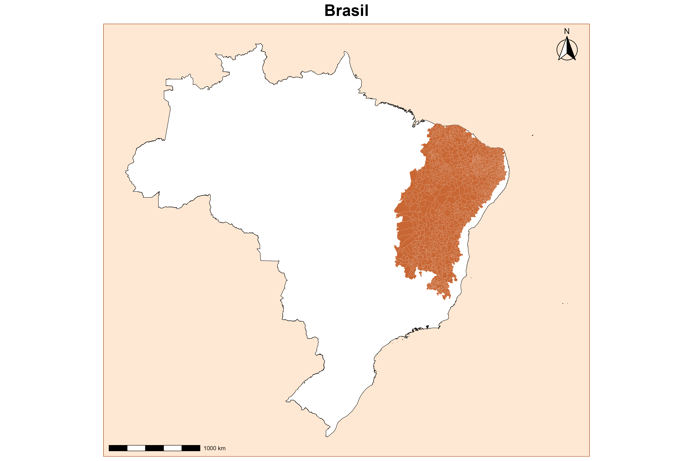
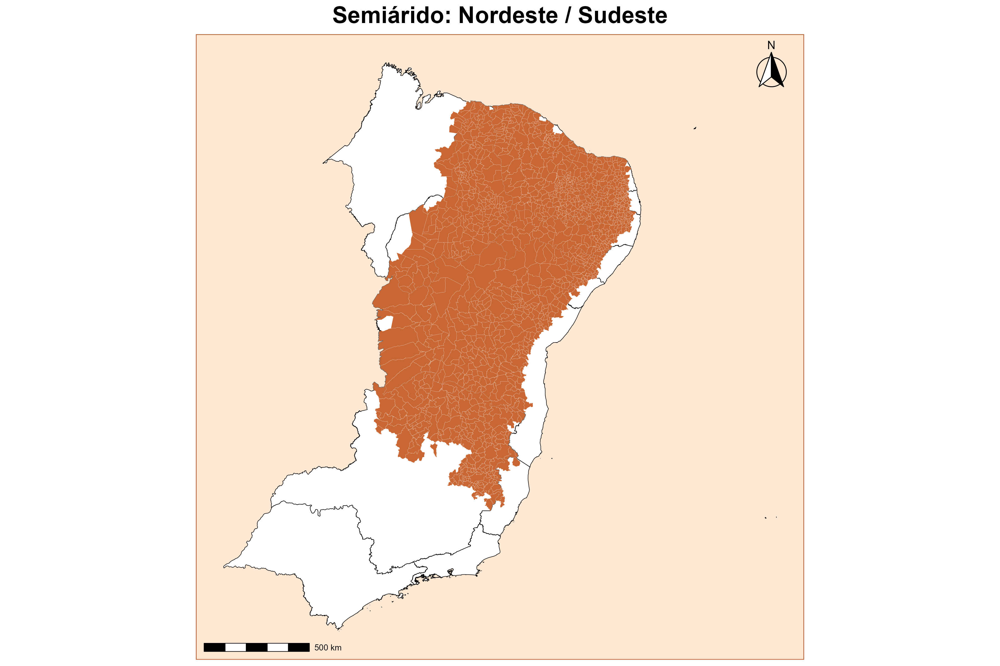

# **GEOBR**{data-background-image="Capa.png" style="text-align:center"}

## **O que é o Geobr?**

 

O pacote **geobr** é uma biblioteca em R desenvolvida pelo Instituto de Pesquisa Econômica Aplicada (IPEA) que permite acessar bases espaciais oficiais do Brasil de forma simples.

 

**Características:**

- Integra dados do IBGE em conjunto com outros órgãos oficiais;
- Retorna objetos espaciais no formato sf;
- Permite análise geográfica e construção de mapas;
- Facilita pesquisas acadêmicas e aplicações governamentais.

 

A versão 2.0 trouxe melhorias importantes de desempenho, armazenamento e precisão espacial.

# **Função read_schools**{data-background-image="Capa.png" style="text-align:center"}

## **O que a base representa?**

A função **read_schools()** disponibiliza a localização geográfica das escolas brasileiras a partir dos dados do Censo Escolar.

:::: columns

::: {.column width="50%"}
::: box-orange
**Características principais:**

* Dados oficiais do INEP;
* Cada registro representa uma escola;
* Geometria do tipo POINT;
* Sistema de referência: SIRGAS 2000 (CRS 4674).
* Nível territorial: Estabelecimento de ensino (escola).
:::
:::

::: {.column width="45%"}
::: box-orange
**Aplicações:**

* Planejamento educacional;
* Estudos de acessibilidade;
* Distribuição espacial das escolas;
* Análises territoriais.
:::
:::
::::

## **Explorando a função**

:::: columns

::: {.column width="35%"}
**Sintaxe**

library(geobr)

schools <- read_schools(  
  year, 
  code_muni = "all", 
  output = "sf", 
  showProgress = TRUE, 
  cache = TRUE, 
  verbose = TRUE    )
:::

::: {.column width="60%"}
| Argumento    | Função                               |
| ------------ | -------------------------------------|
| year         | ano da base                          |
| code_muni    | código do município                  |
| output       | tipo de objeto retornado pela função |
| showProgress | exibe progresso                      |
| cache        | salva localmente                     |
| verbose      | apresenta mensagens informativas     |
:::
::::

 

::: box-orange
**Retorno**
 Classe: > [1] "sf" "data.frame"
:::

## **Estrutura dos dados**

::: {.panel-tabset}

### Informações disponíveis

* Código da escola;
* Nome da escola;
* Município;
* UF;
* Coordenadas geográficas;
* Data de atualização;
* Geometria espacial.
* Novidades da atualização

### A nova versão do geobr

1. melhor organização das bases;
2. armazenamento mais eficiente;
3. integração com formatos modernos;
4. melhoria na qualidade das coordenadas espaciais.

 

**Objetivo principal:** aumentar velocidade e confiabilidade das análises.

:::

## **Mapa: Escolas do Brasil (2025)**

{fig-align="center" width=70%}

## **Sobreposição com read_states**

{fig-align="center" width=70%}

## Sobreposição com read_municipality

{fig-align="center" width=70%}

## 
**Interpretação**

 

* Cada ponto representa uma escola;
* Maior concentração nas áreas urbanizadas;
* Permite visualizar a distribuição espacial tanto nacional, quanto municipal.

# **Função read_semiarid**{data-background-image="Capa.png" style="text-align:center"}

## Semiárido

 

:::: columns

::: {.column width="50%"}
::: box-orange
**Características principais:**

* Dados oficiais do IBGE / SUDENE (Superintendência do Desenvolvimento do Nordeste);
* Delimitação geográfica oficial;
* Geometria do tipo MULTIPOLYGON;
* Sistema de referência: SIRGAS 2000 (CRS 4674).
* Nível territorial: Região geoecológica (recorte por municípios).

:::
:::

::: {.column width="45%"}
::: box-orange
**Aplicações:**

* Formulação de políticas públicas regionais;
* Estudos sobre vulnerabilidade climática e seca;
* Planejamento econômico da área de atuação da SUDENE;
* Análises de governança e fundos constitucionais.

:::
:::

::::

## **Explorando a função**

**Sintaxe**

:::: columns

::: {.column width="35%"}
library(geobr)

read_semiarid( 
  year, 
  simplified = TRUE, 
  output = "sf", 
  showProgress = TRUE, 
  cache = TRUE, 
  verbose = TRUE)
:::

::: {.column width="60%"}
| Argumento    | Função                                         |
| ------------ | -----------------------------------------------|
| year         | ano da base                                    |
| simplified   | simplifica as linhas para carregar mais rápido |
| output       | tipo de objeto retornado pela função           |
| showProgress | exibe progresso                                |
| cache        | salva localmente                               |
| verbose      | apresenta mensagens informativas               |

:::
::::

 

::: box-orange
**Retorno**
 Classe: > [1] "sf" "data.frame"
:::

## **Mapa Semiárido (2022)**

{fig-align="center" width=70%}

##

{fig-align="center" width=70%}

## **Conclusão**

 

:::: columns

::: {.column width="50%"}
::: box-orange
**read_schools()**

✓ Acessa dados georreferenciados do Censo Escolar.

✓ Retorna objetos espaciais do tipo sf.

✓ Trabalha com geometrias do tipo ponto.

✓ Permite visualização espacial simples e sobreposição com outras camadas do geobr.

✓ É útil para planejamento educacional, pesquisa e análise territorial.

:::
:::

::: {.column width="45%"}
::: box-orange
**read_semiarid()** 

✓ Acessa dados da delimitação legal do Semiárido brasileiro.

✓ Trabalha com geometrias do tipo multipolígono.

✓ Permite analisar as atualizações históricas.

✓ Estudos de vulnerabilidade climática e planejamento socioeconômico regional.

:::
:::

::::
